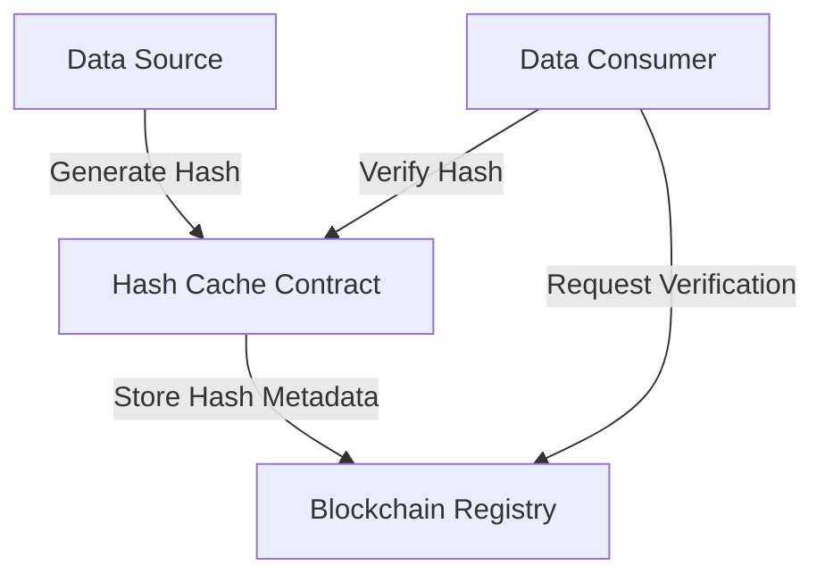

# Hash Cache: Decentralized Data Verification System

Hash Cache is a secure, blockchain-powered data verification and caching mechanism that enables reliable, transparent data integrity tracking and efficient content retrieval.

## Overview

Hash Cache provides a robust solution for maintaining data integrity, tracking changes, and enabling verifiable content retrieval through blockchain-backed cryptographic hashing. The system creates a trustless environment for data validation and storage tracking.

### Key Features

- Immutable hash storage
- Content verification
- Efficient data retrieval tracking
- Decentralized integrity validation
- Flexible caching mechanisms

## Architecture



### Core Contracts

1. **Hash Registry Contract**
   - Manages hash entries
   - Tracks content versions
   - Provides verification mechanisms

2. **Cache Access Contract**
   - Controls hash retrieval
   - Manages access permissions
   - Implements verification logic

## Getting Started

### Prerequisites

- Clarinet (latest version)
- Stacks blockchain wallet

### Installation

1. Clone the repository
2. Install dependencies
3. Run tests
4. Deploy to desired network

### Basic Usage

```clarity
;; Register a new hash entry
(contract-call? .hash-registry store-hash 
    "content-identifier"
    0x1234567890abcdef
    u100)

;; Verify a hash
(contract-call? .hash-access verify-hash
    "content-identifier"
    0x1234567890abcdef)
```

## Security Considerations

- Cryptographic hash verification
- Immutable storage guarantees
- Permissioned access control
- Version tracking
- Transparent audit trails

## Development

### Testing

```bash
clarinet test
```

### Local Development

```bash
clarinet start
clarinet deploy
clarinet console
```

## License

[Specify your license here]